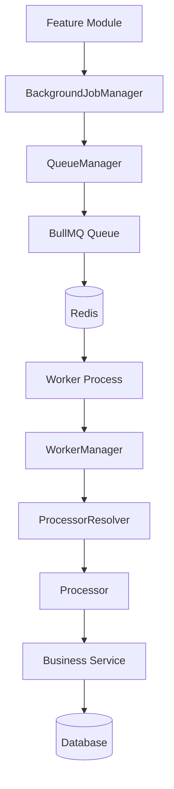
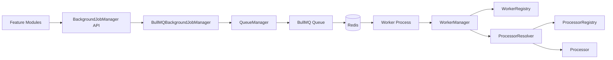
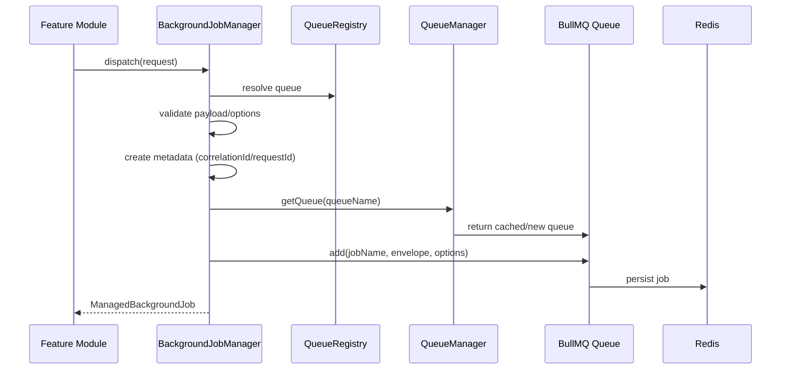
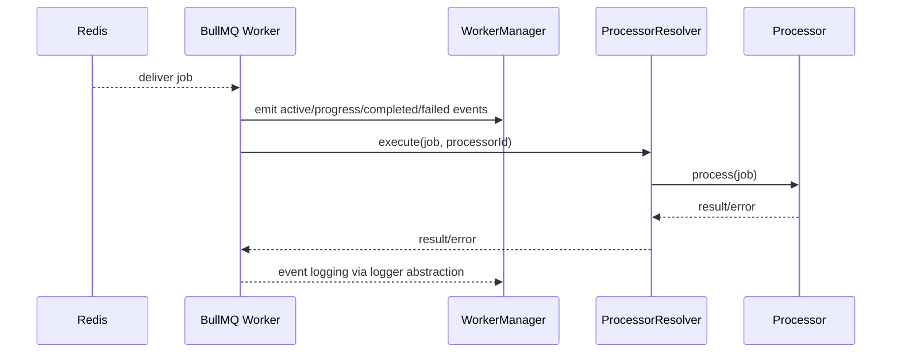
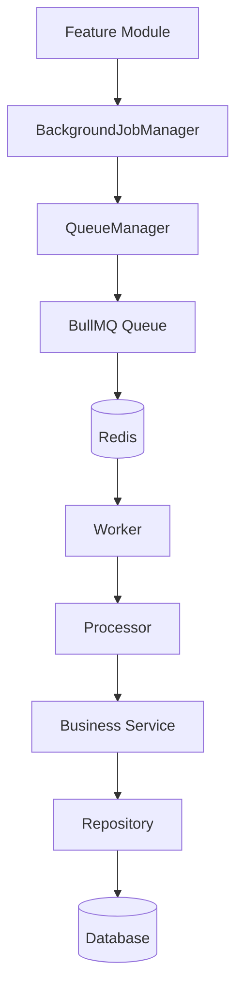
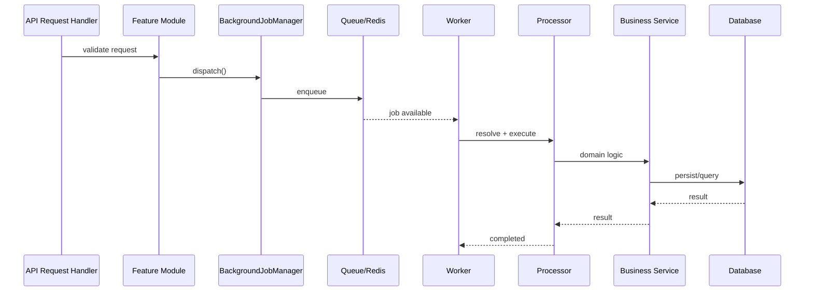
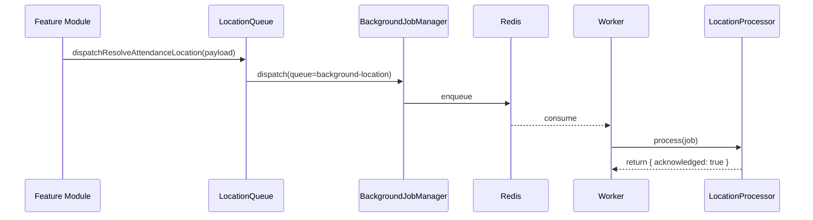

# Background Job Framework Developer Guide

Document version: 1.0.0

Last updated: 2026-07-28

Primary scope: [src/infrastructure/background-jobs](../src/infrastructure/background-jobs)

This document is the single source of truth for the Workdesk24 Background Job Framework.

---

## 1. Overview

### Why this framework exists

The application performs work that should not block request/response latency, such as:

- location resolution and enrichment
- report generation
- image processing
- notifications and email
- maintenance and recovery operations

Synchronous execution of these tasks inside API handlers increases response time, reduces throughput, and makes retries/error recovery difficult.

This framework exists to provide a stable, provider-neutral background processing contract for feature modules.

### Problems it solves

- Decouples API latency from expensive or slow operations.
- Centralizes retry, delay, metadata, status, and cancellation behavior.
- Prevents direct BullMQ coupling in feature modules.
- Enables API process and Worker process to scale independently.
- Standardizes observability through framework-level logging and monitoring.

### Why background jobs are required

Background jobs are required when work can be deferred or recovered independently from API request lifecycle. This includes operations where eventual completion is acceptable and where retry/circuit-breaker behavior must be managed separately.

### Benefits of asynchronous processing

- Lower API p95/p99 latency
- Better resilience through retry policies
- Operational controls: pause/resume/drain/cancel
- Scalable worker pools independent of API instances
- Improved incident recovery with dead-letter workflows

### High-level architecture



---

## 2. Technology Stack

### Components

- BullMQ
- Redis
- Node.js
- TypeScript

### Why BullMQ

BullMQ was selected because it provides:

- robust Redis-backed queue semantics
- retries, delay, priority, rate-safe worker model
- job lifecycle APIs and introspection
- broad production adoption
- first-class TypeScript support

### Why queues are abstracted behind BackgroundJobManager

Feature modules never depend on BullMQ directly. They use [BackgroundJobManager](../src/infrastructure/background-jobs/interfaces/background-job-manager.interface.ts). This abstraction provides:

- provider neutrality
- consistent validation and metadata
- centralized error translation
- safer future migration path (for example, SQS)

---

## 3. Folder Structure

### Complete framework tree

```text
src/infrastructure/background-jobs/
├── config/
│   ├── bullmq.config.ts
│   └── redis.config.ts
├── constants/
│   ├── job-names.constant.ts
│   ├── job-priority.constant.ts
│   ├── processor-names.constant.ts
│   ├── queue-names.constant.ts
│   └── retry-policy.constant.ts
├── errors/
│   └── background-job.error.ts
├── examples/
│   └── location-flow.example.ts
├── interfaces/
│   ├── background-job-manager.interface.ts
│   ├── background-job.interface.ts
│   ├── job-result.interface.ts
│   ├── monitoring.interface.ts
│   ├── processor.interface.ts
│   ├── queue-job-options.interface.ts
│   └── worker.interface.ts
├── managers/
│   ├── BackgroundJobManager.ts
│   ├── BackgroundJobMonitoringService.ts
│   ├── BullBoardManager.ts
│   ├── ProcessorRegistry.ts
│   ├── ProcessorResolver.ts
│   ├── QueueManager.ts
│   └── WorkerManager.ts
├── processors/
│   ├── email.processor.ts
│   ├── image.processor.ts
│   ├── index.ts
│   ├── location.processor.ts
│   ├── notification.processor.ts
│   └── report.processor.ts
├── queues/
│   ├── email.queue.ts
│   ├── image.queue.ts
│   ├── index.ts
│   ├── location.queue.ts
│   ├── notification.queue.ts
│   └── report.queue.ts
├── registry/
│   ├── processor.registry.ts
│   ├── queue.registry.ts
│   └── worker.registry.ts
├── utils/
│   ├── logger.utils.ts
│   ├── queue-cleanup.utils.ts
│   ├── queue.utils.ts
│   └── worker.utils.ts
├── workers/
│   ├── email.worker.ts
│   ├── image.worker.ts
│   ├── index.ts
│   ├── location.worker.ts
│   ├── notification.worker.ts
│   ├── report.worker.ts
│   └── worker-processor.factory.ts
├── index.ts
└── worker.ts
```

### Responsibilities by folder

- config: Redis and BullMQ option composition
- constants: queue names, job names, priority names, retry policy
- errors: framework error taxonomy
- interfaces: public contracts and DTOs
- managers: lifecycle and runtime orchestration classes
- processors: processor implementations (placeholder + real)
- queues: feature-facing queue adapters
- registry: registration composition for queues/workers/processors
- utils: logging and worker/queue utilities
- examples: canonical end-to-end framework flow
- worker.ts: worker process bootstrap entrypoint

---

## 4. Architecture

### Layered architecture



### Dispatch sequence



### Worker execution sequence



### Full business integration flow



---

## 5. Core Components

### BackgroundJobManager

File: [managers/BackgroundJobManager.ts](../src/infrastructure/background-jobs/managers/BackgroundJobManager.ts)

Purpose:

- single application-facing scheduling API
- option validation
- metadata enrichment
- provider error normalization

Responsibilities:

- dispatch, delayed dispatch, bulk dispatch, unique dispatch
- dedup by jobId
- status/progress retrieval
- queue controls and cancellation
- dead-letter move and retry helpers

Dependencies:

- QueueManager
- QueueRegistry
- logger abstraction

Lifecycle:

- singleton export: backgroundJobManager

### QueueManager

File: [managers/QueueManager.ts](../src/infrastructure/background-jobs/managers/QueueManager.ts)

Purpose:

- process-local queue instance cache

Responsibilities:

- create/reuse queue handles
- enumerate framework queues
- close all queue handles on shutdown

### WorkerManager

File: [managers/WorkerManager.ts](../src/infrastructure/background-jobs/managers/WorkerManager.ts)

Purpose:

- own worker process lifecycle

Responsibilities:

- register and start workers
- stop workers
- attach worker event listeners
- SIGINT/SIGTERM/uncaughtException/unhandledRejection handling
- graceful Redis close

### Queue Registry

File: [registry/queue.registry.ts](../src/infrastructure/background-jobs/registry/queue.registry.ts)

Purpose:

- resolve queue identifiers and legacy aliases

### Worker Registry

File: [registry/worker.registry.ts](../src/infrastructure/background-jobs/registry/worker.registry.ts)

Purpose:

- central worker registration composition

### Processor Registry

Files:

- [managers/ProcessorRegistry.ts](../src/infrastructure/background-jobs/managers/ProcessorRegistry.ts)
- [registry/processor.registry.ts](../src/infrastructure/background-jobs/registry/processor.registry.ts)

Purpose:

- register processor instances and keep worker manager closed for modification

### Logger integration

File: [utils/logger.utils.ts](../src/infrastructure/background-jobs/utils/logger.utils.ts)

Purpose:

- define provider-neutral logging boundary with info and error

Runtime adapter:

- [worker.ts](../src/infrastructure/background-jobs/worker.ts) maps framework logger to project logger

### Queue configuration

Files:

- [config/redis.config.ts](../src/infrastructure/background-jobs/config/redis.config.ts)
- [config/bullmq.config.ts](../src/infrastructure/background-jobs/config/bullmq.config.ts)

### Worker bootstrap

File: [worker.ts](../src/infrastructure/background-jobs/worker.ts)

Flow:

1. Initialize Redis connection
2. Initialize WorkerManager
3. Build processor registry/resolver
4. Register workers
5. Start workers
6. Wait indefinitely

---

## 6. Queue Design

### Queue names

Defined in [constants/queue-names.constant.ts](../src/infrastructure/background-jobs/constants/queue-names.constant.ts):

- background-location
- background-notification
- background-email
- background-image
- background-report
- background-system

Legacy aliases are mapped to background-system for backward compatibility.

### Job names

Defined in [constants/job-names.constant.ts](../src/infrastructure/background-jobs/constants/job-names.constant.ts):

- execute
- resolve-attendance-location
- dead-letter

### Queue creation and caching

Queue creation is lazy and cached in QueueManager. Feature modules do not instantiate BullMQ queues directly.

### Priority handling

Priority constants are in [constants/job-priority.constant.ts](../src/infrastructure/background-jobs/constants/job-priority.constant.ts). Lower numeric values run first.

### Retries

Defaults are in [constants/retry-policy.constant.ts](../src/infrastructure/background-jobs/constants/retry-policy.constant.ts):

- attempts: 5
- backoff: exponential, 1000ms
- retention policies for complete/fail

### Concurrency

Worker concurrency default is 5 and is configurable via BACKGROUND_WORKER_CONCURRENCY in [config/bullmq.config.ts](../src/infrastructure/background-jobs/config/bullmq.config.ts).

### Delayed jobs

Use dispatchDelayed or options.delay.

### Bulk jobs

Use dispatchBulk for one queue with multiple jobs.

### Job metadata

Metadata envelope fields from [interfaces/background-job.interface.ts](../src/infrastructure/background-jobs/interfaces/background-job.interface.ts):

- correlationId
- requestId optional
- createdAt
- frameworkVersion

### Correlation ID and Request ID propagation

- correlationId auto-generated if not provided
- requestId included when provided
- both are copied into dead-letter payload metadata when moveToDeadLetter is used

---

## 7. Worker Design

### Worker lifecycle

- definitions registered
- workers started with shared defaults
- events bound
- process signal/error handlers active
- graceful stop and Redis close on shutdown

### Startup

Defined in [worker.ts](../src/infrastructure/background-jobs/worker.ts).

### Shutdown

WorkerManager handles:

- SIGINT
- SIGTERM
- uncaughtException
- unhandledRejection

### Worker registration

Worker definitions are in [workers](../src/infrastructure/background-jobs/workers).
Resolver wiring is composed in [workers/index.ts](../src/infrastructure/background-jobs/workers/index.ts).

### Worker events

Bound in [utils/worker.utils.ts](../src/infrastructure/background-jobs/utils/worker.utils.ts):

- completed
- failed
- active
- waiting
- stalled
- progress
- drained

### Retry behavior and logging

On failed events, logger context includes attemptsMade and maxAttempts and emits retry scheduled when attempts remain.

---

## 8. Processor Design

Processors are intended to contain business logic because they represent the execution unit for deferred work. Workers remain thin orchestration shells.

### Why workers remain thin

- simpler lifecycle and reliability
- lower coupling
- easier testing and mocking
- open/closed extensibility via resolver and registry

### Processor lifecycle

- processor instance registered in ProcessorRegistry
- resolver locates processor by processor id
- worker delegates job execution to resolver
- processor process method returns result or throws

### Creating new processors

1. Create processor class implementing BaseProcessor
2. Add processor name in processor-names.constant.ts
3. Export and include in processors/index.ts factory
4. Map worker definition to processor id in workers/index.ts

---

## 9. Complete Job Lifecycle



Implementation note:

- current repository includes a fully wired framework path and a real location processor that logs payload only.
- business service and database calls are intentionally not embedded in framework code.

---

## 10. Configuration

### Environment variables used by framework

From [config/redis.config.ts](../src/infrastructure/background-jobs/config/redis.config.ts) and [config/bullmq.config.ts](../src/infrastructure/background-jobs/config/bullmq.config.ts):

- REDIS_URL
- REDIS_HOST default 127.0.0.1
- REDIS_PORT default 6379
- REDIS_USERNAME optional
- REDIS_PASSWORD optional
- REDIS_DB default 0
- REDIS_TLS set true to enable TLS object
- BACKGROUND_WORKER_CONCURRENCY default 5

### Defaults and validation

- REDIS_PORT must be integer 1..65535
- REDIS_DB must be non-negative integer
- BACKGROUND_WORKER_CONCURRENCY must be positive integer

### Railway configuration (current)

From [railway.json](../railway.json):

- API start command: node dist/server.production.js
- health check path: /api/health/live

### Future AWS configuration

See section 12 for service mapping without framework API changes.

---

## 11. Railway Deployment

### Current model

- API service: existing Railway service using [railway.json](../railway.json)
- Worker service: separate Railway service recommended
- Redis: Railway Redis or external managed Redis

### Worker startup command

Suggested worker command using existing bootstrap file:

```bash
node dist/infrastructure/background-jobs/worker.js
```

### API startup command

Current:

```bash
node dist/server.production.js
```

### Deployment flow

1. Build image via [Dockerfile](../Dockerfile)
2. Deploy API service
3. Deploy separate worker service with same image but worker start command
4. Ensure both services share Redis credentials

---

## 12. AWS Migration Guide

### Service mapping

- API runtime: Amazon ECS Fargate or App Runner
- Worker runtime: separate ECS/App Runner service using worker bootstrap
- Redis: Amazon ElastiCache for Redis
- Database: Amazon RDS (already independent of framework)

### Future provider option: Amazon SQS

Current queue abstraction remains in BackgroundJobManager. Feature modules do not depend on BullMQ, so provider migration impact is concentrated in manager/worker internals.

### What remains unchanged

- feature-module call pattern
- dispatch request contracts
- queue/job naming constants
- processor/worker separation

---

## 13. Developer Quick Start

Goal: add a new background job in under five minutes.

1. Dispatch job from feature module using BackgroundJobManager.
2. Create processor implementing BaseProcessor.
3. Register processor in processors/index.ts and processor registry factory.
4. Register worker mapping in workers/index.ts.
5. Start worker process and verify logs.

---

## 14. Usage Guide

All examples below use existing framework APIs.

### Dispatch job

```ts
import { backgroundJobManager, QUEUE_NAMES, JOB_NAMES } from '../infrastructure/background-jobs';

await backgroundJobManager.dispatch({
  queue: QUEUE_NAMES.LOCATION,
  job: JOB_NAMES.RESOLVE_ATTENDANCE_LOCATION,
  payload: {
    attendanceId: 'att-1001',
    latitude: 28.6139,
    longitude: 77.209,
    requestedAt: new Date().toISOString(),
  },
});
```

### Dispatch delayed job

```ts
await backgroundJobManager.dispatchDelayed(
  {
    queue: QUEUE_NAMES.REPORT,
    job: JOB_NAMES.EXECUTE,
    payload: { reportId: 'r-1' },
  },
  60_000,
);
```

### Dispatch bulk jobs

```ts
await backgroundJobManager.dispatchBulk({
  queue: QUEUE_NAMES.EMAIL,
  jobs: [
    { job: JOB_NAMES.EXECUTE, payload: { template: 'welcome', userId: 'u-1' } },
    { job: JOB_NAMES.EXECUTE, payload: { template: 'welcome', userId: 'u-2' } },
  ],
});
```

### Dispatch high priority job

```ts
import { JOB_PRIORITY } from '../infrastructure/background-jobs';

await backgroundJobManager.dispatch({
  queue: QUEUE_NAMES.NOTIFICATION,
  job: JOB_NAMES.EXECUTE,
  payload: { notificationId: 'n-1' },
  options: { priority: JOB_PRIORITY.URGENT },
});
```

### Dispatch custom retry job

```ts
await backgroundJobManager.dispatch({
  queue: QUEUE_NAMES.IMAGE,
  job: JOB_NAMES.EXECUTE,
  payload: { imageId: 'img-1' },
  options: {
    attempts: 10,
    backoff: { type: 'exponential', delay: 2_000 },
  },
});
```

### Dispatch job with metadata

```ts
await backgroundJobManager.dispatch({
  queue: QUEUE_NAMES.SYSTEM,
  job: JOB_NAMES.EXECUTE,
  payload: { action: 'sync' },
  options: {
    correlationId: 'corr-123',
    requestId: 'req-456',
    metadata: {
      initiatedBy: 'admin-api',
      tenantId: 'tenant-1',
    },
  },
});
```

### Dispatch unique job (dedupe by jobId)

```ts
await backgroundJobManager.dispatchUnique({
  queue: QUEUE_NAMES.REPORT,
  job: JOB_NAMES.EXECUTE,
  payload: { reportId: 'r-daily' },
  options: { jobId: 'report:r-daily' },
});
```

### Get job status

```ts
const status = await backgroundJobManager.getJobStatus(QUEUE_NAMES.LOCATION, 'job-id');
```

### Get job progress

```ts
const progress = await backgroundJobManager.getJobProgress(QUEUE_NAMES.LOCATION, 'job-id');
```

### Remove job

```ts
await backgroundJobManager.remove(QUEUE_NAMES.LOCATION, 'job-id');
```

### Retry job

```ts
await backgroundJobManager.retry(QUEUE_NAMES.LOCATION, 'job-id');
```

### Retry failed jobs in batch

```ts
const retried = await backgroundJobManager.retryFailedJobs(QUEUE_NAMES.LOCATION, { limit: 50 });
```

### Pause queue

```ts
await backgroundJobManager.pauseQueue(QUEUE_NAMES.EMAIL);
```

### Resume queue

```ts
await backgroundJobManager.resumeQueue(QUEUE_NAMES.EMAIL);
```

### Drain queue

```ts
await backgroundJobManager.drainQueue(QUEUE_NAMES.SYSTEM, { includeDelayed: true });
```

### Cancel job

```ts
const canceled = await backgroundJobManager.cancel(QUEUE_NAMES.LOCATION, 'job-id');
```

### Move failed job to dead-letter

```ts
await backgroundJobManager.moveToDeadLetter(QUEUE_NAMES.LOCATION, 'job-id', {
  reason: 'manual-triage',
});
```

---

## 15. Payload Design

### Conventions

- Payload must be a plain object.
- Keep payload minimal and serializable.
- Pass identifiers and context, not large data blobs.

### Examples

```ts
type AttendancePayload = {
  attendanceId: string;
  latitude: number;
  longitude: number;
  requestedAt: string;
};

type VisitPayload = {
  visitId: string;
  hostId: string;
  requestedAt: string;
};

type NotificationPayload = {
  notificationId: string;
  userId: string;
};

type EmailPayload = {
  template: string;
  userId: string;
};

type ImagePayload = {
  imageId: string;
  operation: 'compress' | 'resize';
};

type ReportPayload = {
  reportId: string;
  rangeStart: string;
  rangeEnd: string;
};
```

Why small payloads:

- lower Redis memory usage
- faster enqueue/dequeue
- fewer serialization failures
- better resilience under load

---

## 16. Queue Registration

Current queue registry logic is in [registry/queue.registry.ts](../src/infrastructure/background-jobs/registry/queue.registry.ts).

Step-by-step:

1. Add new queue name in queue-names.constant.ts
2. Use queue identifier in dispatch request
3. QueueRegistry resolves and validates at runtime
4. QueueManager creates/caches BullMQ queue handle

---

## 17. Worker Registration

Current worker registration composition is in [registry/worker.registry.ts](../src/infrastructure/background-jobs/registry/worker.registry.ts) and [workers/index.ts](../src/infrastructure/background-jobs/workers/index.ts).

Step-by-step:

1. Add worker definition file in workers folder
2. Export definition in workers/index.ts
3. Add mapping from worker definition to processor id using createWorkerProcessor
4. WorkerRegistry.registerAll injects definitions into WorkerManager

---

## 18. Processor Example

Production-quality processor pattern with logging, progress, and error handling:

```ts
import type { Job } from 'bullmq';
import { PROCESSOR_NAMES, type BaseProcessor, type JobPayload, type BackgroundJobLogger } from '../infrastructure/background-jobs';

interface ExampleResult {
  acknowledged: true;
}

export class ExampleProcessor implements BaseProcessor<JobPayload, ExampleResult> {
  public readonly id = PROCESSOR_NAMES.REPORT;

  public constructor(private readonly logger: BackgroundJobLogger) {}

  public async process(job: Job<JobPayload, ExampleResult, string>): Promise<ExampleResult> {
    try {
      await job.updateProgress(10);

      this.logger.info('Example processor started.', {
        queue: job.queueName,
        jobId: String(job.id),
        jobName: job.name,
      });

      await job.updateProgress({ step: 'validated' });

      this.logger.info('Example processor finished.', {
        queue: job.queueName,
        jobId: String(job.id),
      });

      return { acknowledged: true };
    } catch (error: unknown) {
      this.logger.error('Example processor failed.', error, {
        queue: job.queueName,
        jobId: String(job.id),
      });
      throw error;
    }
  }
}
```

Notes:

- Input is BullMQ Job because BaseProcessor is defined that way.
- Output is typed.
- Exceptions are rethrown so retry policy can apply.

---

## 19. Worker Example

Worker definitions are intentionally thin. Example from [workers/location.worker.ts](../src/infrastructure/background-jobs/workers/location.worker.ts):

```ts
import { QUEUE_NAMES } from '../constants/queue-names.constant';
import type { WorkerDefinition } from '../interfaces/worker.interface';

export const locationWorkerDefinition: WorkerDefinition = {
  id: 'location-worker',
  name: 'Location Worker',
  queue: QUEUE_NAMES.LOCATION,
};
```

Line-by-line intent:

- id: unique worker identifier for lifecycle logs and registration
- name: human-readable name in logs/ops dashboards
- queue: queue binding only
- no business logic in worker definition

Resolver wiring is added in [workers/index.ts](../src/infrastructure/background-jobs/workers/index.ts).

---

## 20. End-to-End Example

Canonical implementation file:

- [examples/location-flow.example.ts](../src/infrastructure/background-jobs/examples/location-flow.example.ts)

This verifies:

- Feature module dispatch via LocationQueue
- BackgroundJobManager enqueue
- Worker startup/registration
- Processor resolution/execution
- Payload logging in LocationProcessor

Dispatch-to-processor summary:



Business service and database calls are intentionally excluded from framework code. Add those in domain-specific processors.

---

## 21. Adding a New Background Task

Checklist:

1. Add processor name in processor-names.constant.ts
2. Add queue name in queue-names.constant.ts if needed
3. Add job name in job-names.constant.ts
4. Create queue adapter in queues folder
5. Create processor in processors folder
6. Register processor in processors/index.ts
7. Create worker definition in workers folder
8. Map worker->processor in workers/index.ts
9. Add feature-module dispatch call through BackgroundJobManager or queue adapter
10. Add monitoring and alert expectations
11. Validate in worker logs and status APIs

Common task examples:

- image compression
- push notification
- email send
- PDF generation
- reverse geocoding
- AI processing

---

## 22. API Reference

Primary contract file:

- [interfaces/background-job-manager.interface.ts](../src/infrastructure/background-jobs/interfaces/background-job-manager.interface.ts)

### dispatch(request)

- Params: DispatchRequest
- Returns: ManagedBackgroundJob
- Throws: BackgroundJobValidationError, BackgroundJobProviderError

### dispatchBulk(request)

- Params: DispatchBulkRequest
- Returns: ManagedBackgroundJob[]

### dispatchDelayed(request, delay)

- Params: DispatchRequest, delay milliseconds
- Returns: ManagedBackgroundJob

### dispatchUnique(request)

- Params: DispatchRequest with options.jobId
- Returns: ManagedBackgroundJob
- Throws if jobId missing

### remove(queue, jobId)

- Removes existing job

### retry(queue, jobId)

- Retries one failed job

### retryFailedJobs(queue, options)

- Retries up to options.limit failed jobs
- Returns retried count

### moveToDeadLetter(queue, jobId, options)

- Copies failed job context to system dead-letter job
- Removes original job

### cancel(queue, jobId)

- Removes removable job
- Returns false for missing or active jobs

### getJob(queue, jobId)

- Returns managed job or null

### getJobState(queue, jobId)

- Returns state or null

### getJobProgress(queue, jobId)

- Returns number, object, or null

### getJobStatus(queue, jobId)

- Returns normalized status snapshot or null

### pauseQueue(queue), resumeQueue(queue), drainQueue(queue, options)

- Operational queue controls

### isCompleted, isFailed, isActive, isWaiting

- Convenience state predicates

Error classes:

- [errors/background-job.error.ts](../src/infrastructure/background-jobs/errors/background-job.error.ts)

---

## 23. Best Practices

- Always dispatch through BackgroundJobManager.
- Never create BullMQ Queue directly in feature modules.
- Keep workers thin and orchestration-only.
- Put business logic in processors.
- Use queue constants and job constants.
- Use strongly typed payload interfaces.
- Keep payloads small and idempotency-friendly.
- Use correlationId and requestId for traceability.
- Prefer dispatchUnique with deterministic jobId for dedupe-sensitive flows.
- Use status APIs before manual recovery actions.

---

## 24. Anti-Patterns

Do not do these:

- Calling BullMQ directly from API modules
- Writing business logic in WorkerManager or worker definitions
- Passing huge payload objects in jobs
- Ignoring retries and pushing infinite attempts
- Creating ad-hoc queue names outside constants
- Swallowing processor exceptions that should trigger retries

Bad example:

```ts
// Avoid direct queue creation inside feature module
import { Queue } from 'bullmq';
const q = new Queue('my-random-queue');
```

Good example:

```ts
await backgroundJobManager.dispatch({
  queue: QUEUE_NAMES.SYSTEM,
  job: JOB_NAMES.EXECUTE,
  payload: { action: 'safe-path' },
});
```

---

## 25. Troubleshooting

### Redis disconnected

Symptoms:

- provider errors during dispatch/start

Actions:

- verify REDIS_URL or REDIS_HOST/REDIS_PORT values
- verify TLS flag alignment with provider
- check worker bootstrap redis init path in worker.ts

### Worker not running

Symptoms:

- jobs stay waiting

Actions:

- verify worker process command
- verify WorkerRegistry registration
- verify signal/crash logs

### Job stuck

Symptoms:

- repeated waiting/active without completion

Actions:

- inspect worker event logs
- inspect getJobStatus and getJobProgress
- verify processor throws and retries are configured

### Retries not happening

Actions:

- inspect attempts/backoff in dispatch options
- verify processor throws on failure
- inspect failed events and retry scheduled logs

### Delayed jobs not firing

Actions:

- verify delay is non-negative integer
- ensure worker process is running

### Failed jobs increasing

Actions:

- call retryFailedJobs for controlled retries
- move to dead-letter for triage

### Queue congestion

Actions:

- increase worker concurrency
- split high-volume tasks into separate queues
- use pause/resume/drain controls carefully

### Deployment issues

Actions:

- ensure API and Worker share same Redis
- ensure worker command points to dist worker bootstrap

---

## 26. FAQ

### Can feature modules import BullMQ directly?

They should not. Use BackgroundJobManager.

### Is deduplication automatic?

Dedupe is jobId-based. Use dispatchUnique with options.jobId.

### Can I add custom metadata?

Yes, use options.metadata. Framework still adds core metadata.

### How do I track a request across async boundaries?

Set correlationId and requestId in dispatch options.

### Where do I implement business logic?

In processors, not workers.

### How do I recover failed jobs in bulk?

Use retryFailedJobs(queue, { limit }).

### Is there dead-letter support?

Yes, moveToDeadLetter creates a dead-letter job in background-system queue.

### Can I inspect queue health?

Use BackgroundJobMonitoringService and BullBoardManager.

---

## 27. Design Decisions

### Decision: provider abstraction

Trade-off:

- Pro: migration-ready feature modules
- Con: additional adapter code

### Decision: worker-process separation

Trade-off:

- Pro: independent scaling and failure isolation
- Con: deployment complexity (second service)

### Decision: metadata envelope

Trade-off:

- Pro: observability and trace propagation
- Con: slightly larger payload footprint

### Decision: thin workers, processor-centric execution

Trade-off:

- Pro: cleaner SRP and easier testing
- Con: one extra indirection layer

### Decision: additive operational APIs

Trade-off:

- Pro: backward compatible evolution
- Con: broader manager surface area

---

## 28. Versioning

### Framework version

- Current framework version metadata value: 1.0.0

### Release notes (current milestone summary)

- Milestone 1-2: foundational queue/dispatch contracts
- Milestone 3: worker framework and lifecycle
- Milestone 4: processor framework with resolver/registry
- Milestone 5: monitoring, health, Bull Board, cleanup utilities
- Milestone 6: complete location end-to-end framework example
- Milestone 7: production operational APIs and dead-letter strategy

### Future roadmap

- stronger typed payload registries per domain
- optional provider adapter for SQS
- richer dead-letter replay tooling
- metrics export for Prometheus/OpenTelemetry

### Changelog template

```md
## [x.y.z] - YYYY-MM-DD
### Added
- ...

### Changed
- ...

### Fixed
- ...

### Deprecated
- ...

### Removed
- ...
```

---

## 29. AI Coding Assistant Guide

This section is intentionally optimized for GitHub Copilot, ChatGPT, Codex, Claude, Cursor, and similar tools.

### Architecture map for assistants

- Entry abstraction for feature modules: BackgroundJobManager
- Queue handle lifecycle: QueueManager
- Worker lifecycle: WorkerManager
- Processor resolution: ProcessorResolver + ProcessorRegistry
- Worker process entrypoint: worker.ts

### Folder responsibilities

- queues: feature-facing adapters only
- workers: queue binding definitions only
- processors: deferred execution logic
- managers: framework orchestration
- constants: names and defaults

### Extension rules

- Do not bypass BackgroundJobManager in feature code.
- Do not put business logic in worker definitions.
- Additive changes only for backward compatibility.
- Reuse constants for all queue/job/processor identifiers.

### Coding standards

- TypeScript
- strongly typed payloads
- no any
- async/await
- framework logging through logger abstraction

### Naming conventions

- queue files: *.queue.ts
- worker files: *.worker.ts
- processor files: *.processor.ts
- constants: *.constant.ts

### Files assistants should usually modify

- constants/job-names.constant.ts
- constants/processor-names.constant.ts
- constants/queue-names.constant.ts
- queues/*.queue.ts
- processors/*.processor.ts
- workers/*.worker.ts
- workers/index.ts
- processors/index.ts

### Files assistants should be careful with

- managers/BackgroundJobManager.ts
- managers/QueueManager.ts
- managers/WorkerManager.ts
- worker.ts

These are core framework internals and should be changed only when required.

### Pre-implementation checklist for assistants

1. Is a new queue required, or can an existing queue be reused?
2. Is a new job name added in constants?
3. Is payload type defined and minimal?
4. Is processor registered and resolver reachable?
5. Is worker mapped to processor id?
6. Is logging non-sensitive and structured?

### Post-implementation checklist for assistants

1. Feature module dispatches only through BackgroundJobManager or queue adapter.
2. Worker contains no business logic.
3. Processor handles errors by throw for retry semantics.
4. Status/progress APIs still work.
5. Exports updated in index.ts if needed.
6. Build and diagnostics pass.

---

## 30. Code Examples Library

### 30.1 Location queue adapter usage

```ts
import { locationQueue } from '../infrastructure/background-jobs';

const job = await locationQueue.dispatchResolveAttendanceLocation({
  attendanceId: 'att-9001',
  latitude: 28.6139,
  longitude: 77.209,
  requestedAt: new Date().toISOString(),
});

const state = await locationQueue.getJobState(job.id);
```

Expected output behavior:

- job is enqueued in background-location queue
- worker consumes job
- location processor logs payload
- state transitions to completed

### 30.2 Monitoring service snapshot

```ts
import { BackgroundJobMonitoringService } from '../infrastructure/background-jobs';
import { redisConnection } from '../infrastructure/background-jobs/config/redis.config';

const monitoring = new BackgroundJobMonitoringService({ redisConnection });

const health = await monitoring.getFrameworkHealth();
const queueStats = await monitoring.getQueueStatistics();
const failed = await monitoring.getFailedJobs(10);
```

### 30.3 Queue cleanup utility

```ts
import { QueueCleanupUtils, QUEUE_NAMES } from '../infrastructure/background-jobs';

const cleanup = new QueueCleanupUtils();

await cleanup.cleanQueue(QUEUE_NAMES.SYSTEM, 'failed', { graceMs: 0, limit: 500 });
```

### 30.4 Bull Board integration in Express

```ts
import express from 'express';
import { BullBoardManager } from '../infrastructure/background-jobs';

const app = express();
const board = new BullBoardManager();

board.initialize();
app.use(board.getBasePath(), board.getRouter());
```

### 30.5 Full framework-only end-to-end smoke flow

```ts
import { redisConnection } from '../infrastructure/background-jobs/config/redis.config';
import { runLocationFlowExample } from '../infrastructure/background-jobs/examples/location-flow.example';

await runLocationFlowExample(
  {
    attendanceId: 'att-demo-003',
    latitude: 28.6139,
    longitude: 77.209,
    requestedAt: new Date().toISOString(),
  },
  {
    redisConnection,
    logger: {
      info: () => undefined,
      error: () => undefined,
    },
  },
);
```

---

## Appendix A: Public Entry Points

Main public exports are available from:

- [index.ts](../src/infrastructure/background-jobs/index.ts)

Worker runtime entrypoint:

- [worker.ts](../src/infrastructure/background-jobs/worker.ts)

---

## Appendix B: Operational Notes

- Current Railway configuration in [railway.json](../railway.json) starts API only.
- Worker service command must be configured separately.
- Docker image currently defaults to API startup via [Dockerfile](../Dockerfile).

---

End of document.
